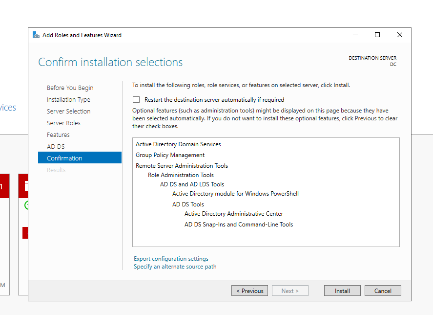
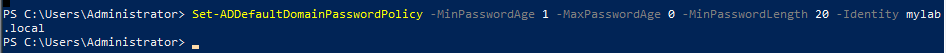
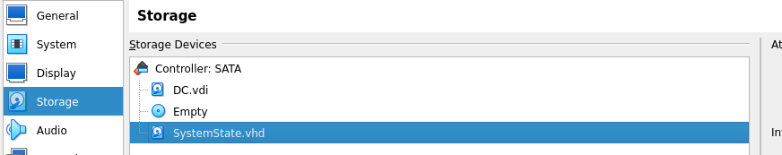

# Chapter 1: Welcome to my home lab! 
I decided that an solid foundation for my home lab would be an Active Directory Domain Controller. It's the perfect seed to sprout a big tree of different managed devices, on top of which, we can experiment with a plethora of security controls. Among the branches I plan to build, secure, attack, investigate, and respond!

---
# Installing a Domain Controller
* I originally planned for using a Windows Server 2022 .iso to create a Domain Controller in Virtualbox.
* It will have two interfaces: one for my private network, and one to access the public internet for later integration with my planned Azure cloud infrastructure. Later on, I plan to create a gateway firewall and perhaps a deep packet inspection proxy, but this my first home lab, so I'm not too concerned with getting everything right the first time. In a deployment intended for production I would implement basic LAN and gateway security first, and I would create conceptual, logical, and physical network designs even before that. I plan to create a network diagram later on to showcase my entire lab environment.  For this lab though, keeping the virtualbox NAT interface disabled unless there's something I want to download will suffice. I'd like to keep things loose so that I can have an enjoyable, yet educational experience.
* I decided not to spend much time on writing about certain tasks like provisioning the machine in virtualbox. There are already a trillion tutorials for that type of stuff, so I'd like to keep my documentation concise in some areas. I'll focus on details when I get to more abstruse topics. In addition, these labs are meant to showcase my technical skills to prospective employers, and I won't be spending much time explaining syntax, writing in customer-friendly language, or displaying every single error and workaround. If you have any questions or criticism, feel free to reach out to me on LinkedIn. linkedin.com/in/dylan-r-cyber


* I originally made a Server 2022 domain named korok.forest with accounts and groups manually, and using a script created by Josh Madakor, but I tore it down and rebuilt a Server 2019 DC because I found some great scripts for provisioning a robust AD population, as well as for automated CIS hardening and auditing.
## I created several user accounts, and then I used an awesome script from activedirectorypro.com that creates a huge population of users, groups, and OU's!
!


---
## After the installation and setup of a Domain Admin, I used best practices from my SANS SEC401 curriculum to configure the Default Domain Policy, including password complexity and account lockout.


* The SEC401 curriculum also contains a wealth of other Active Directory best practices including security event log and audit policies. I will be deferring to their recommendations quite often to configure additional security controls.
* I defined the Default Domain Policies in `Computer Configuration > Windows Settings > Security Settings > Local Policies > Audit Policy` so that basic security auditing can be applied on all computers within the domain, regardless of who logs on to them.

---
# I made a backup of my new Domain and validated the restoration of the system state in preparation for automated hardening according to industry security baselines.
* As recommended in SANS's SEC301 course, CIS benchmarks can be used as a great starting point for hardening a system. I read through some of the Server 2022 benchmark to get a feel for it, but I soon realized that if I were to manually configure all of the recommended security controls in these 1000+ page manuals, I wouldn't be able to get very far with my home lab this year. I did some research and I found a collection of ansible automation and auditing scripts on github called ansible-lockdown! That should speed things up.
	* https://github.com/ansible-lockdown
 * Investigating further into my options, such as Microsoft baselines, DISA STIG's, USGCB,  I decided that I need to figure out which benchmark will be best for my education, and for my use case. In the meantime, it's a good idea for me to back up my DC because I don't want to apply a huge configuration which breaks my production machine!
	 * https://public.cyber.mil/stigs/gpo/
	 * https://learn.microsoft.com/en-us/windows/security/operating-system-security/device-management/windows-security-configuration-framework/windows-security-baselines
	 * https://downloads.cisecurity.org/#/
## Backing Up the DC
* Prior to using a script which may break my machine, I originally created a backup using a virtualbox shared folder and a complete backup.


* Instead, I configured continuous backups of the system state using a virtual hard disk. This is better for my use case because it only retains what is necessary to rebuild the Domain and takes up less storage space. (I'm in short supply.) In addition, storing the system state on a virtual network share only allows you to save the most recent version, so you can't keep versioning backups. I don't have enough storage space to perform versioning, but I will set it up as though I did for now.


After my first test of the backup, I realized that my VHD was not large enough, and the full backup would only be a few more gigabytes, so I opted for a full backup on the next attempt. This time I decided to do it with Powershell. I found most of the commands needed to perform these backups by executing `Get-Command -Name *backup*`, and then `Get-Command -Name *wb*` in Powershell. I then researched them here: https://learn.microsoft.com/en-us/powershell/module/windowsserverbackup/?view=windowsserver2022-ps
```powershell
PS C:\Users\Administrator> $Pol = New-WBPolicy
PS C:\Users\Administrator> $Vol = Get-WBVolume -VolumePath C:
PS C:\Users\Administrator> Add-WBVolume -Policy $pol -Volume $Vol
PS C:\Users\Administrator> Add-WBSystemState $pol
PS C:\Users\Administrator> Add-WBBareMetalRecovery $pol
PS C:\Users\Administrator> $BackupDrive = New-WBBackupTarget -VolumePath F:
PS C:\Users\Administrator> Add-WBBackupTarget -Policy $pol -Target $BackupDrive


Label                  : Local Disk
WBDisk                 :
WBVolume               : Local disk (F:)
Path                   : \\?\Volume{xxxxxxxxxxxxxxxxxxxxxxxxxxxxxxxxxxxx}
TargetType             : Volume
InheritAcl             : False
PreserveExistingBackup : False


PS C:\Users\Administrator> Set-WBVssBackupOption -Policy $Pol -VssFullBackup
PS C:\Users\Administrator> echo $Pol


Schedule              :
BackupTargets         : {F:}
VolumesToBackup       : {Local disk (C:)}
FilesSpecsToBackup    :
FilesSpecsToExclude   :
ComponentsToBackup    :
BMR                   : True
SystemState           : True
OverwriteOldFormatVhd : False
VssBackupOptions      : VssFullBackup
PS C:\Users\Administrator> Start-WBBackup -Policy $Pol
Start-WBBackup : There is not enough free space on the backup storage location to back up the data.
```
* Here I powered down and made a new disk, reentered the previous WB powershell commandlets, then continued.
``` powershell
PS C:\Users\Administrator> get-disk

Number Friendly Name                                                                                                                                                        Serial Number                    HealthStatus         OperationalStatus      Total Size Partition
                                                                                                                                                                                                                                                                    Style
------ -------------                                                                                                                                                        -------------                    ------------         -----------------      ---------- ----------
0      VBOX HARDDISK                                                                                                                                                        VBxxxxxxxxxxxxxxxxx              Healthy              Online                      50 GB MBR
1      VBOX HARDDISK                                                                                                                                                        VBxxxxxxxxxxxxxxxxx              Healthy              Online                      20 GB GPT
PS C:\Users\Administrator> New-Partition -DiskNumber 1 -UseMaximumSize -DriveLetter X
PS C:\Users\Administrator> Format-Volume -DriveLetter X -FileSystem NTFS

DriveLetter FriendlyName FileSystemType DriveType HealthStatus OperationalStatus SizeRemaining  Size
----------- ------------ -------------- --------- ------------ ----------------- -------------  ----
X                        NTFS           Fixed     Healthy      OK                     19.94 GB 20 GB
PS C:\Users\Administrator> $BackupDrive = New-WBBackupTarget -VolumePath X:
PS C:\Users\Administrator> Add-WBBackupTarget -Policy $pol -Target $BackupDrive
PS C:\Users\Administrator> Set-WBVssBackupOption -Policy $pol -VssFullBackup
PS C:\Users\Administrator> echo $pol


Schedule              :
BackupTargets         : {X:}
VolumesToBackup       : {Local disk (C:)}
FilesSpecsToBackup    :
FilesSpecsToExclude   :
ComponentsToBackup    :
BMR                   : True
SystemState           : True
OverwriteOldFormatVhd : False
VssBackupOptions      : VssFullBackup

PS C:\Users\Administrator> Start-WBBackup -Policy $pol
Initializing the list of items to be backed up...
Volume 1 (99%) of 2 volume(s).
Volume 2 (20%) of 2 volume(s).
Volume 2 (43%) of 2 volume(s).
Volume 2 (67%) of 2 volume(s).
Volume 2 (91%) of 2 volume(s).
The backup operation completed.
PS C:\Users\Administrator> Get-WBBackupSet


VersionId        : 09/19/2023-00:56
BackupTime       : 9/18/2023 5:56:25 PM
BackupTarget     : X:
RecoverableItems : Volumes, SystemState, Applications, Files, BareMetalRecovery
Volume           : {System Reserved, Local disk (C:)}
Application      : {FRS, AD, Registry}
VssBackupOption  : VssFullBackup
SnapshotId       : xxxxxxxxxxxxxxxxxxxxxxxxxxxxxxxxxxxx
BackupSetId      : xxxxxxxxxxxxxxxxxxxxxxxxxxxxxxxxxxxx
```
* And now to validate the backup! According to SANS's Keith Palmgren, "If the backup does not have validated recovery, it is not a backup - it is, at best, a hope!"* According to his full definition, this won't be a true validated backup because it is not stored on a separate media device, and I'll only be validating the system state. I won't tell if you don't!
```powershell
PS C:\Users\Administrator> Start-WBSystemStateRecovery -BackupSet $Backup

Warning
Start system state recovery to original location ?
[Y] Yes  [N] No  [S] Suspend  [?] Help (default is "Y"): y
Initializing.
System state recovery failed to complete.
WARNING: A computer restart is required to complete the system state recovery operation.

Warning
Restart the computer?
[Y] Yes  [N] No  [S] Suspend  [?] Help (default is "Y"):
```
* Little did I know, this backup can only be performed from Directory Services Restore Mode, and so it was erroring out.
* I needed to reboot into DSRM in order to recover
```powershell
PS C:\Users\Administrator> bcdedit.exe /set safeboot dsrepair
The operation completed successfully.
PS C:\Users\Administrator> shutdown.exe /r /t 0
```
* After Reboot:

(There's no drag-n-drop clipboard by default when booting from safe mode in virtualbox)


---
## Now that that's over, it's time for me to get hard! 

# Next time, I'll be testing several different security baseline hardening and auditing automations! See you soon!
---
## My inspiration for this stage of the home lab came from many places:
* SANS SEC301, 401, 504
* https://www.youtube.com/watch?v=MHsI8hJmggI
* https://activedirectorypro.com/create-active-directory-test-environment/
* https://activedirectorypro.com/backup-active-directory/
* https://www.ultimatewindowssecurity.com/tools/Output-ADUsersAsCSV/default.aspx
* https://activedirectorypro.com/search-active-directory/
* https://github.com/ansible-lockdown
* https://www.youtube.com/watch?v=y6LXDD0LM44
