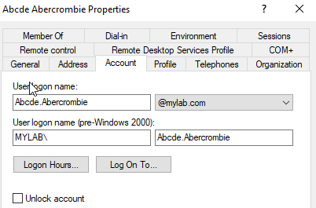
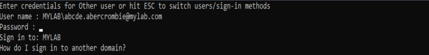

# Chapter 2  
##### *October 2nd, 2023*
---
# In this Chapter:
* Joining a Windows VM to the Domain
* Installing Parrot OS - Resource and Package Management in Debian Systems Using Limited Resources
* Some Absurdist Parsing Practice

Welcome back to my homelab journal! In the previous chapter I had decided to work on hardening next, but I decided to further flesh out my home lab and check out some more options. I just got back from vacation and I had some time to think about what direction I'd like to take this. I'm certainly going to do hardening in a chapter soon, but I'd like to expand my infrastructure some more and see about some other experiments. 

You'll notice that the structure, objectives, and content will likely change from chapter to chapter. I like the idea of writing in the form of journal entries for now. I appreciate your interest while I find my stride.

As I'm sure you noticed in Chapter 1, my markdown aesthetic could use some work, so I'll try to buff that out over time.

---------
## Client Setup, Joining the Domain

*I created a Windows Server 2019 box to use as a client (ironic) without a desktop environment to save on host resources, and to force myself to use more Powershell (though to be honest I really like the CLI). I then configured the local network adapter as shown above.*


*Next I configured the DNS setting on my client and tested it with ping.*


*Here I bounced over to the DC to create a non-default administrator account for our fictional Admin, Abcde Abercrombie since I hadn't done so yet.*

``` powershell
PS C:\Users\Administrator> $password = Read-Host -AsSecureString
***********************************************************************
PS C:\Users\Administrator> echo $password
System.Security.SecureString
PS C:\Users\Administrator> Set-ADAccountPassword -Identity "Abcde.Abercrombie" -NewPassword $password
```
*I set Abcde's password using a secure string.*


*I joined Abcde's client to the domain.*

``` powershell
PS C:\Users\Administrator> Restart-Computer
```

*Finally, I restarted the computer and logged in to the domain account.*
## Parrot OS Setup, and Resource Management


I imported a Parrot .ova, but it hung my computer, so I had to press `Alt+Ctrl+F1'` to switch to another tty. Luckily I was able to log in and kill the Parrot vm in the other tty so that I didn't need to resort to the `SysRq` key or perform a hard reboot. This time I'll be installing the core version of Parrot so that I can further save on resources. I might even use security templates later or my backup of the DC to remove that GUI too. 

While having limited resources (8 gigs RAM, 128 gigs storage, and an i5) might seem tedious, it's helping me to foster frugality in my resource management habits and learn how to operate with the bare necessities and built-in functionality. In addition, it's forcing me to build things in a more manual fashion. I'm running all of this on a Debian host which started with no display manager, desktop environment, or gui applications. I've been installing lightweight packages when absolutely necessary with a preference for CLI and fewer dependencies. I also configured awesomewm for productivity and riced it. 


I'll reinstall a parrot "architect" vm and start from scratch. I'll install a DE and anything else I need from the parrot repo's and I'll only keep packages for as long as I'm using them. This type of behavior also forces me to figure out how to hold on to and manipulate configuration files for various applications in case I need to install them again later. I won't do any ricing this time, even though its extremely conducive to my ~~procrastination~~ productivity.


*Something about a fresh distro is like a new car smell! Looks like parrot starts with its network adapters turned off? Convenient for stealth I suppose. I chose to install LXQt since it's lightweight, I haven't tried it before, and it was in the Parrot repo for easy access. I'm hoping it comes with a display manager. If not, I might try out Xstart.* 


*I'm in luck! It came with a display manager. After I logged in, I realized that I had also installed a bunch of suggested packages without thinking about it. I'll go through and clean them out super quick.*

# Some Parsing Fun


*It wasn't so quick! I ended up practicing some bash parsing skills. On the way, I decided I wanted to test whether or not github flavored markdown has a code block coloring format for bash... or even the fancy 2 line prompt. In the process I realized that my clipboard wasn't working. I decided to use netcat to send the data to my host machine instead. In the end, the markdown couldn't highlight it:*
``` bash
┌─[parrot@parrot]─[~]
└──╼ $cat /var/log/apt/history.log | grep "install lxqt" -A 2 | tail -n 1 | sed 's/([^)]*)//g' | sed 's/\:amd64//g' | sed 's/\s,//g' > Desktop/extrapacks
```


*There were quite a few extra records! I'll just look through the list instead and get rid of ones that pop out...*

# Installing `lxqt-core` with `lightdm` Instead
##### On second thought, it was much easier to purge the entire desktop environment and reinstall rather than investigate packages line-by-line, so that's what I did. I'm as set up as I'm going to get for now without spending too much time getting side tracked. Tomorrow I'm going to look into setting up Suricata, Splunk, and maybe I'll even have time to attempt detecting a few Metasploit exploits!
