# Chapter 3:  
* Setting up another barebones server for Suricata
* More resource management
* Initial nmap scan
##### *October 4th, 2023*
---
# Intro
In this chapter, my goal is to set up a Suricata IDS on my VLAN, modify it's .yaml file and watch for my own malicious activity.

# Suricata Setup
### Adapter Config
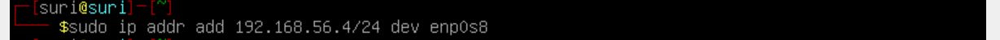
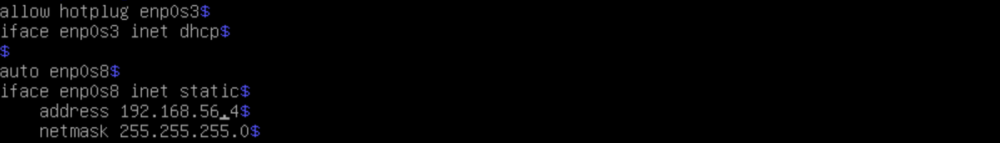
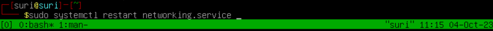
I modified the `/etc/network/interfaces` file so that it connects enp0s8 to the vbox intnet at boot. I'm leaving the virtual network cable for enp0s3 unplugged and I set it to connect with the vbox NAT whenever I need to download some packages from the internet. I did the same with my evil Parrot box.
### Real-world considerations
I suppose that a corporate environment would have a proxy set up, and perhaps an update caching server for compartmentalizing any updates or software installs to this IDS, but I'm not a security architect so I've never built a corporate network from scratch, and so I'm going to enable a vbox NAT whenever I need to download anything for now. Later on, I'd love to set up a firewall, content filter, vpn gateway, and web proxy with deep packet inspection using another laptop so that I can compartmentalize the machines on my laptop into a "trusted" network segment. I doubt that I create enough traffic for it to be a big performance hit, but it will be interesting to see how my hardware holds up when I complete that project.
### suricata.yaml

# More Resource Management
Some packages were hanging when I tried running all four VM's at once. I'm going to install a new DC running server 2022 core, transfer the system state from the server 2019, and then decommission the original DC.
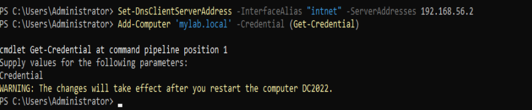
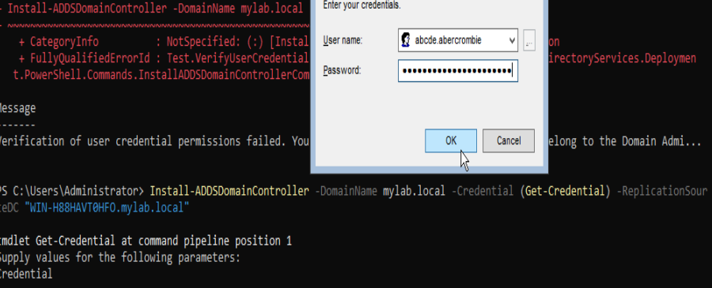
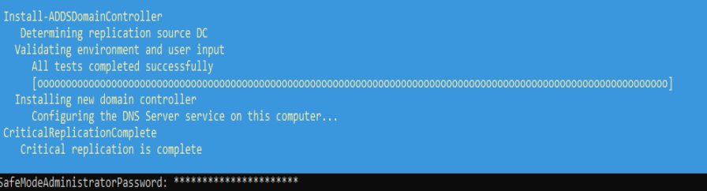
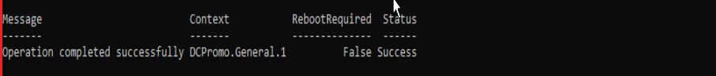
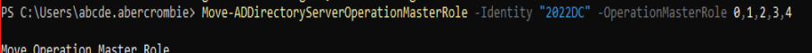
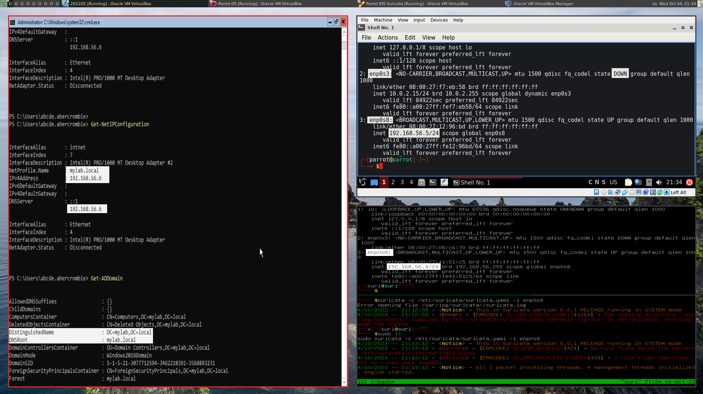

After quite a lot of breaking things and rebuilding them, I managed to get them up and running, minus another windows host, but I have 2 gigs of memory left according to htop, so I'm going to do more optimizing later, or I'll set up my other laptop and connect to the VLAN.
# Making some noise 
I'll run some basic nmap scans against Suricata and the DC just to see if anything shows up in Suricata logs or the event viewer with default settings.
### Scanning the DC
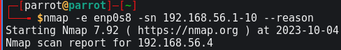
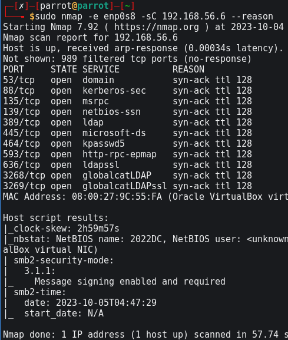
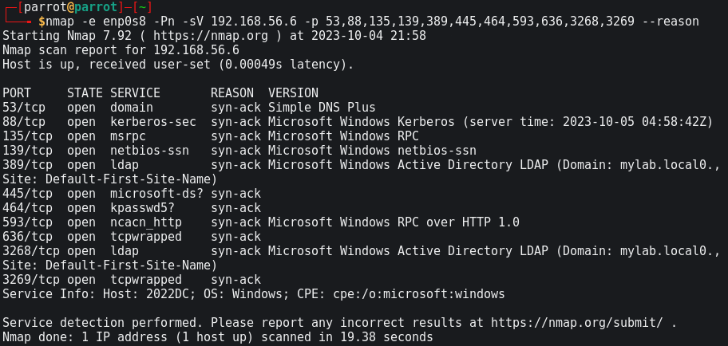
### Scanning Parrot "Architect Edition" w/ Suricata
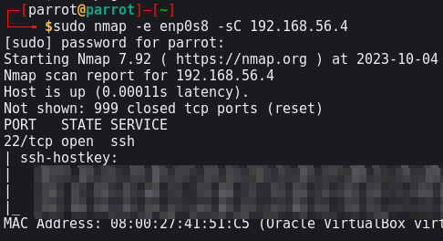
*I can see that SSH is open by default. It must have to do with Parrot OS or remote admin for Suricata*

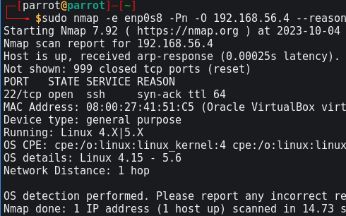
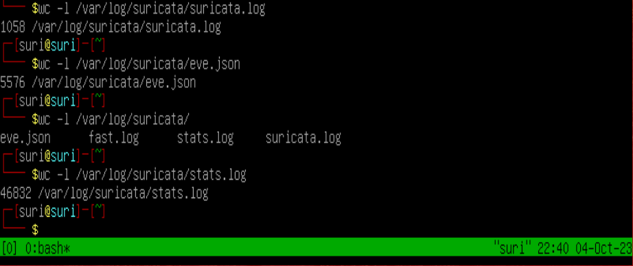
# See you next time!
That's enough for today. There's a whole lot of breaking and fixing stuff behind the scenes so I've been doing a lot more than what you can see in these journal entries. I'll start again tomorrow to look at the logs, and then I plan to configure suricata in-depth.