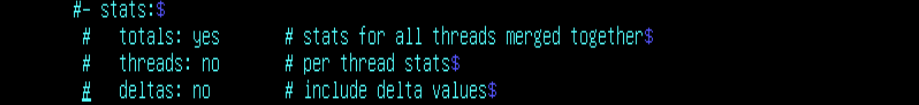
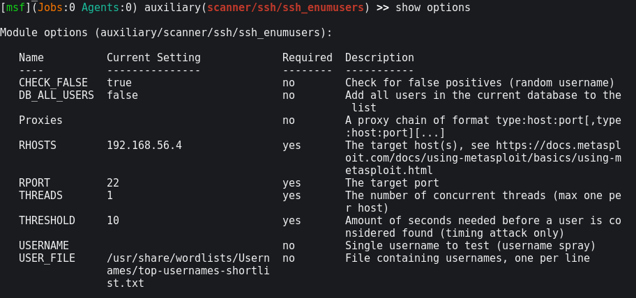
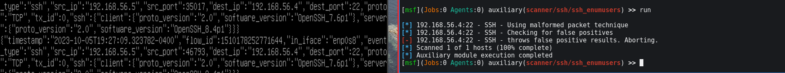
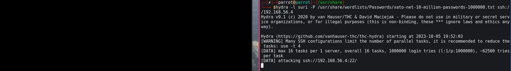
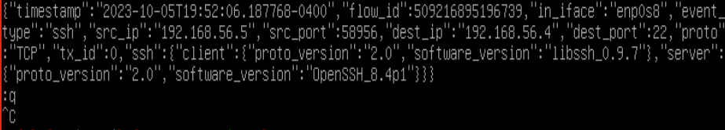

# Chapter 4:  
* Nmap, Metasploit, Hydra, Testing Suricata
##### *October 6th, 2023*
---
### Getting Suricata Ready

*I noticed in the previous entry that I forgot to install signatures for the IDS.*

*I disabled stats logging in the eve.json, because I'm only trying to show the messages from the scans for now to make sure that Suricata is running properly.*

### Metasploit ssh User Enumeration

I added the username "suri" to a file in the seclists package for realism. The ssh service was open on the suricata box so I used the ssh_enumusers auxiliary scanner from metasploit. At first everything came back positive, so I set the CHECK_FALSE option to true since it didn't make sense for any of the usernames in that admin file to come back positive. As you can see on the left, suricata lit up as soon as I sent the traffic.

I thought that I caused a DoS on my suri machine when I first tried this, but when I pressed a key, the screen came back. This probably had to do with the `tail -f` command I was using. It did record the dictionary password guessing attack, though it did not document it as an alert or an anomaly. It did however tag the earlier metasploit ssh_enumusers module as anomalous.

At this point it's clear that Suricata is working, but obviously I'll need to ingest these into something like Splunk, ELK, or maybe try out evebox unless I want to sharpen my chops with jq. I'll also need to start creating some rules.

# Thanks for reading, and I'll see you soon.
