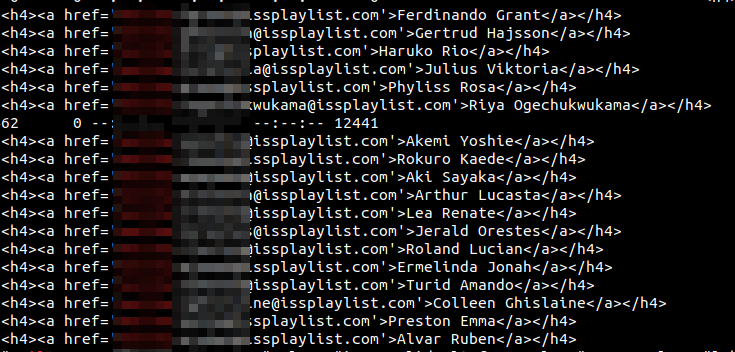
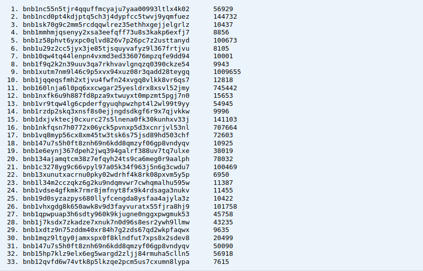
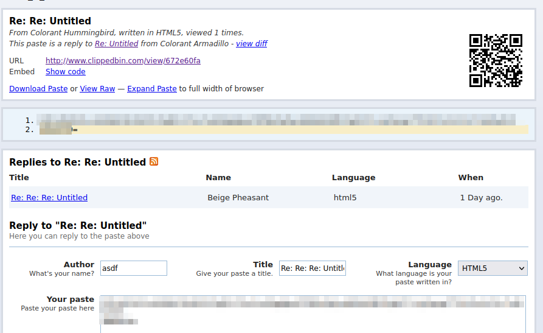

# Chapter 5:  
##### *October 12th, 2023*
* SANS CTF from SEC504
* Website Recon
* DNS Vulnerability
* Insecure Camera Subdomain
* SQLi 
* Command Injection
* Reverse Shells
* msfvenom and msfconsole
* meterpreter
* Process Migration / Privilege Escalation
---
# Intro

I bricked my host and started a part-time job, so I had to take a break from my home lab while I rebuilt everything and got adjusted.

I got some advice on my home lab that I ought to try out Kali Purple in order to streamline my home lab and practice war games. While I enjoy messing around with networking and configuring various new machines, my goal here is to practice offensive and defensive operations. In addition, I'm tired of running into memory limitations, so I'll be setting up my other laptop to run it as the offensive box using Kali.

In the mean-time I decided to complete the capstone CTF from SANS's SEC504, which I have yet to complete since it wasn't required for course completion. That's what this chapter will be about. I'm not sure how much I can share here without breaking the rules. I'll have to be a little bit cryptic in this journal entry.

***Warning to Sans Students! This may contain spoilers!!!***

## Website Reconnaissance

I've been tasked by the company, ISS Playlist to help them with some security investigations.

To start out, I was given a website where I was tasked with finding different pieces of information about a target company. I used my browser to discover email formats, some employee PII, a music playlist creation app, and take in the environment.

Now I've got some email, usernames, and full names to start with if I need to perform some security testing later.

I've been directed to investigate a webapp bulletin called clippedbin[.]com

Right off the bat, I found an apache struts CVE: 2018-11776 vulnerability, a reference to a webmin CVE-2019-15107 vuln, and several recently leaked passwords from the ISS Playlist website. I also found a subdomain pointing to a security camera remote administration page on the ISS Playlist website, along with default credentials. They've all been posted by someone who's going by *BSH*. This site is being used as a drop zone for hackers! I'll add these passwords to a wordlist as well.

I also found a mysterious list of what appear to be hashes, prefixed with "bnb".

My customers let me know that there was some proprietary info (a flag) that they're looking for on the site. I quickly found the flag by performing a basic search, but I was curious to see if I could find anything else.

## Mystery Cipher

I found some suspicious communications on the web app:

Looks like a salted password. I'll come back to this one later.

## DNS Enumeration

I've been directed to investigate a vulnerability at one of the company's DNS servers.

## Directory Enumeration

## Insecure Camera Subdomain

I took a look at the insecure remote camera domain to see what the attacker saw. Based on what I saw there, the attacker has discovered some critical information. "BSH" now knows that his victims are on to him, and aware of his presence. In response to this discovery, the attacker will likely take steps to enhance his persistence on the network. Alternatively, the attacker might cover tracks, cut losses, and trigger ransomware. This is why it's important to avoid letting on to the adversary that you've initiated an IR protocol.

## SQLi

I found an SQLi bug in their playlist generation demo on the main site. I'll try some manual SQLi, and then an automated tool. 

For the kick of it, I tried the automated tool's -a flag, which retrieves everything, instead of enumerating the tables one-by-one. It dumped a password hash table with usernames, a flag, and a bunch of other useful information:

After I finished exploring the very long output from the -a flag, I decided to investigate the tables one-by-one for more concise results.

I saved the password table I found for use with my favorite tool ever: hashcat!

I'll crack the rest of these in a future entry.
## Command Injection

On a subdomain for song uploads, I found an input field that errors when you don't enter the ID of a valid submission. After looking around I found the robots.txt file, inside of which was a disallow entry which I used to test in the input field

This resulted in a successful output and another flag, though I still needed to find a way to leverage this. I tried following the valid ID up with several attempts at linux command injection such as `&&`, `||`, and `;` but none of them were working. I took a hint from the sec504 curriculum and I also decided to check out https://github.com/payloadbox/command-injection-payload-list to figure out how I could exploit this. It turns out that I wasn't interacting with a linux webserver:

Injection successful!

I saw an interesting file that probably contained some hashes, and might even be related to our adversary, *BSH,* and I'd rather explore that a little bit more comfortably, so I'm going to make that happen with my admin privileges.

# msfvenom Reverse Shell

I served it up with an expedient python http.server.

## LOL *Living off the land*

I used the certutil.exe Microsoft tool listed by the LOLBAS project to send my msfvenom reverse shell via a simple python server. https://lolbas-project.github.io/lolbas/Binaries/Certutil/

That feels awesome!

And that feels even better!

## Privilege Escalation

## That's enough for an entry. Thanks for reading! See you next time.
