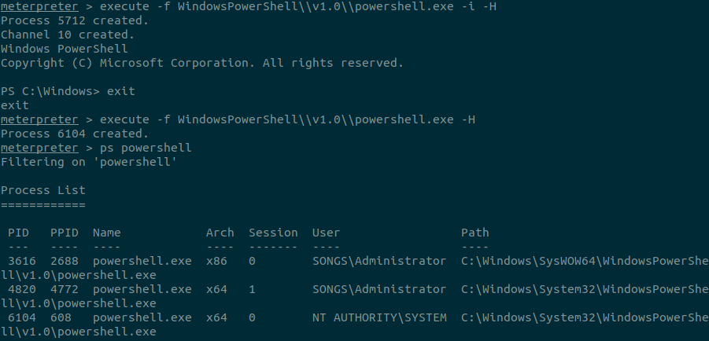

# Chapter 6:
##### *Friday, October 13th, 2023*
* Using a WMI Subscription to Establish Persistence
---
## Intro

In this chapter, I'll be continuing my investigation of the ISS Playlist website. Read Chapter 5 if you want to start from the beginning.

## Using a WMI Subscription to Establish Persistence

``` powershell
PS C:\Windows\system32> net user /add notsus Muchsecure1!       
net user /add notsus Verysecure1!
The command completed successfully.

PS C:\Windows\system32> net localgroup administrators /add notsus
net localgroup administrators /add notsus
The command completed successfully.
```

I created an extra admin account on the compromised web server to act as a primary method of persistence.


I can log in later using rpcclient or smbclient, but I'd like to use a method that's a little harder to find than by typing `Get-LocalUser`. I'll try Metasploit's `exploit/windows/local/wmi_persistence`:


I had some trouble for a while figuring out how to get the `wmi_persistence` exploit to run. I'm not sure how to background a meterpreter session while still in Powershell...





First I tried the above, where I started a Powershell process that had SYSTEM privileges, hiding it with -H, then migrating to it. Sadly, it didn't:


I bet I fixed it!


I think I'm going to persist in a different direction now...


After some research, I found out that some modules may be incompatible with `wmi_persistence`. I'll try using a different module for the reverse shell.


I switched to the more basic `exploit/windows/meterpreter/reverse_tcp` module and it worked!!! 

The `wmi_persistence` module works by creating a WMI `Windows Management Instrumentation` subscription to a windows event. The default event used by the `wmi_persistence` module is a failed login to an account named "BOB". You can choose any account name that you want, or even use an entirely different event ID. I used the default event, and switched the username to "Guest". Once the target machine detects the security log event ID `4625 Failed Logon` for the account "Guest," it will send a reverse shell to my waiting listener.


# Happy Friday, and see you next time!